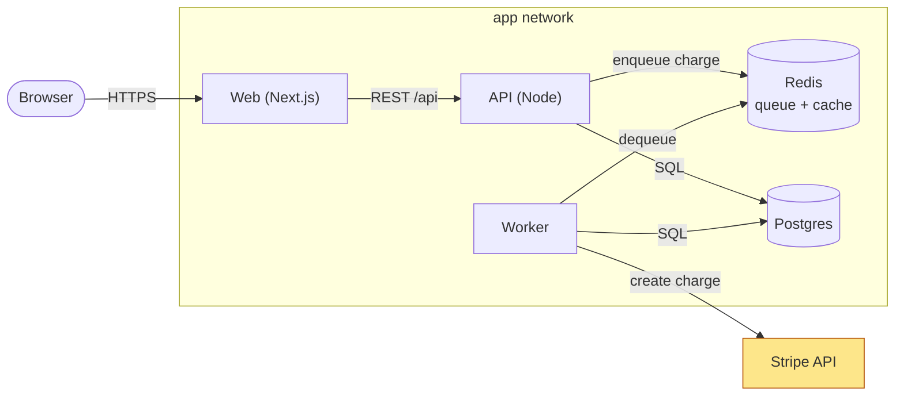

Most architecture diagrams lie. They were drawn once on a whiteboard, drifted as the code changed, and now mislead the next person who trusts them. This skill draws diagrams *from the repository* — by reading entry points, module boundaries, service calls, and the schema — so the picture reflects what exists today. It picks the single view that answers the question instead of one sprawling everything-diagram, and emits Mermaid, which renders natively in GitHub, GitLab, Obsidian, and most docs tooling with no image pipeline.

## When to use this skill

- You're onboarding to an unfamiliar repo and need a map of the services and how they call each other before you start changing anything.
- You're documenting a system for a README, ADR, or design doc and want a diagram that won't go stale the moment someone reads the code.
- One specific flow is hard to reason about — a checkout, an auth handshake, a webhook fan-out — and you want it laid out as a sequence over time.
- You need the data model visible (tables, foreign keys, cardinality) or the lifecycle of a stateful entity (an order, a job, a subscription).

## Instructions

1. **Choose the view before drawing anything.** Pick the *one* diagram type that answers the actual question — they are not interchangeable:
   - **Container / component (`graph` or `flowchart`)** — "what are the services/modules and who calls whom?" Use for onboarding and system overviews.
   - **Sequence (`sequenceDiagram`)** — "how does *this one request* move through the system over time?" Use for a single flow with ordering, async, and error paths.
   - **ER (`erDiagram`)** — "what is the data model and how are entities related?" Use when the schema is the question.
   - **State (`stateDiagram-v2`)** — "what states can *this entity* be in and what transitions are legal?" Use for orders, jobs, payments, finite-state logic.
   If the question spans concerns, emit two small diagrams, not one fused diagram.
2. **Find the real boundaries — read, don't assume.** Locate evidence before drawing a single node:
   - Entry points: `Glob` for `main.*`, `app.*`, `server.*`, `index.*`, route files, `Procfile`, `docker-compose.yml`, `*.tf`, k8s manifests, `package.json`/`pyproject.toml` workspaces.
   - Service-to-service edges: `Grep` for HTTP clients (`fetch`, `axios`, `requests`, `httpx`), queue/topic names, gRPC stubs, and env vars like `*_URL`/`*_HOST` that name a dependency.
   - Data stores: connection strings, ORM models, migration files, `*.sql`, `schema.prisma`.
   A node or edge goes in the diagram only if you found it in the code or config — never because the architecture "should" have it.
3. **Build the chosen diagram from that evidence.**
   - *Container/component:* one node per deployable/service/module; directed edges labeled with the real protocol or call (`-->|REST|`, `-->|publishes order.created|`). Group with `subgraph` by boundary (per process, per network zone). Mark external systems (Stripe, S3, a third-party API) distinctly so the trust boundary is obvious.
   - *Sequence:* one participant per real actor/service; arrows in call order (`->>` sync request, `-->>` response, `-)` async/fire-and-forget); use `alt`/`opt` for the error and conditional branches you found, not idealized happy-path only.
   - *ER:* `erDiagram` with real table/entity names, key attributes (mark `PK`/`FK`), and correct crow's-foot cardinality (`||--o{`) read from the foreign keys, not guessed.
   - *State:* `stateDiagram-v2` with `[*]` start/end, named transitions, and only the states the code actually models.
4. **Cut everything that doesn't serve the diagram's purpose.** A container view does not need every helper class; a sequence diagram does not need every logging call. Aim for a diagram a reader can absorb in one screen. If a container view exceeds ~12 nodes, split it: one high-level map plus a zoom-in on the busy subgraph.
5. **Validate the Mermaid.** Check that the first line declares the diagram type, every node referenced in an edge is defined, labels with special characters are quoted (`["Auth Service (OIDC)"]`), and the block is fenced as ` ```mermaid `. Broken Mermaid renders as a red error box in GitHub — worse than no diagram.
6. **Write and caption.** Emit the diagram(s) into the requested doc (or return inline), and follow each with one line stating what it *does* and *does not* show (e.g. "Shows synchronous request flow for checkout; does not show the async receipt-email worker or retry behavior").

> [!WARNING]
> A stale or wrong diagram is worse than none — readers trust a picture more than prose and will design against a lie. Draw only edges and nodes you found in the code, and date or version-anchor the diagram so the next reader knows when it was true.

> [!NOTE]
> Resist the everything-diagram. A single chart that crams services, data model, and request flow into one canvas communicates nothing — no reader can hold it. Each diagram answers exactly one question; if you have two questions, draw two diagrams.

## Output

For each request, the skill returns:

1. **The chosen view + rationale** — e.g. "Sequence diagram, because the question is about ordering across services in one flow, not the static topology."
2. **Paste-ready Mermaid** in a fenced ` ```mermaid ` block, built from real entry points and calls.
3. **A scope caption** — one line on what the diagram does and does not show.

Example — a container view of a small web app, traced from `docker-compose.yml` (web, api, worker, redis, postgres) and the API's HTTP client to Stripe:



*Shows the deployed services and their call/data edges as wired in `docker-compose.yml` and the API client. Does not show request timing/order (use a sequence diagram) or the table schema (use an ER diagram).*
